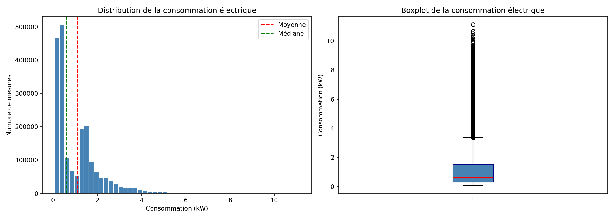
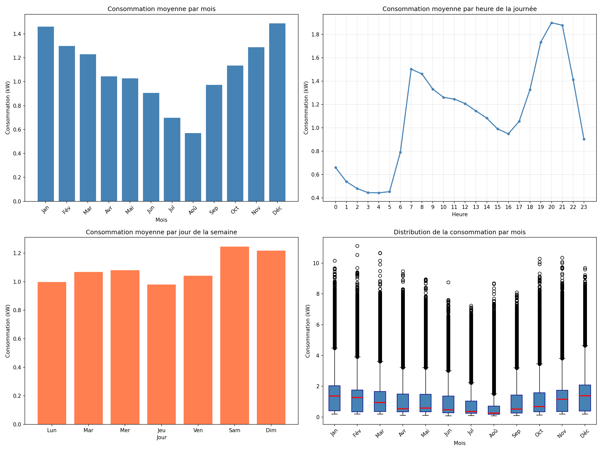

# projet-cie-consommation

### Analyse de Consommation Électrique — Contexte CIE


**!**[**Python**](**https://img.shields.io/badge/Python-3.x-blue**)
**!**[**Pandas**](**https://img.shields.io/badge/Pandas-2.x-green**)
**!**[**Matplotlib**](**https://img.shields.io/badge/Matplotlib-3.x-orange**)
**!**[**Status**](**https://img.shields.io/badge/Status-Completed-brightgreen**)


#### Description

Analyse exploratoire d'un dataset de consommation électrique
réelle (2 millions de mesures sur 4 ans) dans le cadre d'une
formation Data Analyst appliquée au secteur de l'énergie.

Ce projet simule les analyses réalisées par un Data Analyst
à la ******CIE (Compagnie Ivoirienne d'Électricité)******.

---

#### Questions métier


| Question                                        | Type d'analyse   |
| ----------------------------------------------- | ---------------- |
| Quelle est la consommation moyenne, min, max ?  | Univariée       |
| La consommation varie-t-elle selon les mois ?   | Bivariée        |
| Quelles heures sont les plus consommatrices ?   | Bivariée        |
| Le week-end consomme-t-il plus que la semaine ? | **---**Bivariée |

**---**

#### Structure du projet


projet-cie-consommation/
├── data/
│   ├── household_power_consumption.txt
│   └── household_power_consumption.txt.zip
├── outputs/
│   ├── bivarie_consommation - interpretation.txt
│   ├── bivarie_consommation.png
│   ├── univarie_consommation - interpretation.txt
│   └──univarie_consommation.png
├── venv/
├── .gitignore
├── analyse_consommation_cie.ipynb
├── LICENSE
├── README.md
└──requirements.txt

---

#### Résultats clés

#### 
    Analyse Univariée

- Consommation **moyenne** : 1.092 kW
- Consommation **médiane** : 0.602 kW
- **Pic maximum** détecté : 11.122 kW
- Distribution **asymétrique à droite** avec outliers significatifs

#### 
    Analyse Bivariée

 **Par mois :**

- Pic en **Décembre-Janvier** (~1.45 kW)
- Creux en **Juillet-Août** (~0.6 kW)

**Par heure :**

- Creux nocturne **0h-5h** (~0.4 kW)
- Pic matinal **7h** (~1.5 kW)
- Pic du soir **20h-21h** (~1.9 kW) ← critique pour le réseau

**Par jour :**

- Week-end **+25%** de consommation vs semaine

---

#### Visualisations


### Distribution de la consommation



### Consommation par mois, heure et jour



---

#### Recommandations CIE

1. **Renforcer le réseau** aux heures de pointe (20h-21h)
2. **Anticiper les pics saisonniers** selon le contexte ivoirien
3. **Surveiller les outliers** comme indicateurs de fraude possible
4. **Proposer des tarifs réduits** la nuit pour lisser la demande

---

#### Technologies utilisées

- **Python 3** — langage principal
- **Pandas** — manipulation des données
- **Matplotlib** — visualisations
- **Seaborn** — visualisations avancées
- **Jupyter Notebook** — environnement d'analyse

---

#### Comment reproduire ce projet

```bash
# 1. Cloner le repo
git clone https://github.com/KaynorData/projet-cie-consommation.git

# 2. Créer l'environnement virtuel
python -m venv env
env\Scripts\activate

# 3. Installer les dépendances
pip install -r requirements.txt

# 4. Lancer Jupyter
jupyter notebook
```

---

#### Auteur

**Beh Konaté** — Data Analyst en formation
🔗 [GitHub](https://github.com/KaynorData)
🎥 [YouTube](https://www.youtube.com/@KaynorData)
📧 kaynordata@gmail.com
